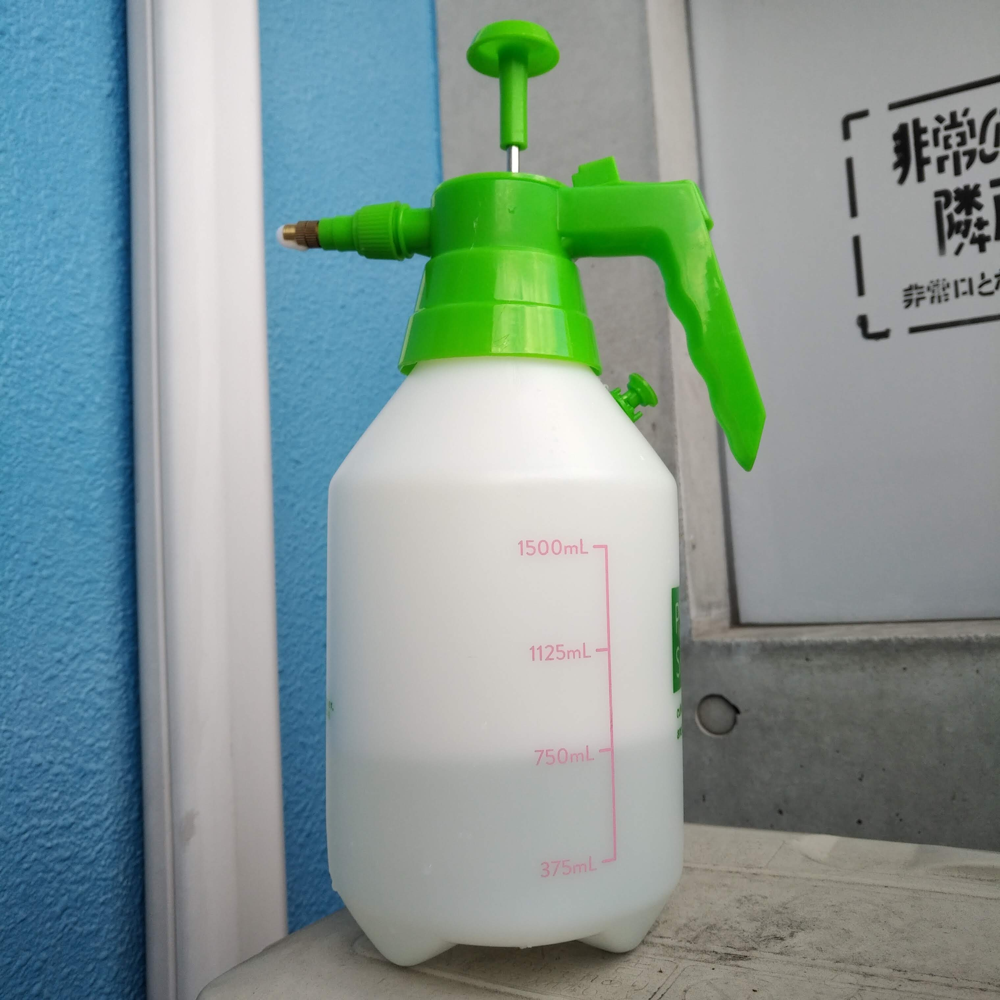
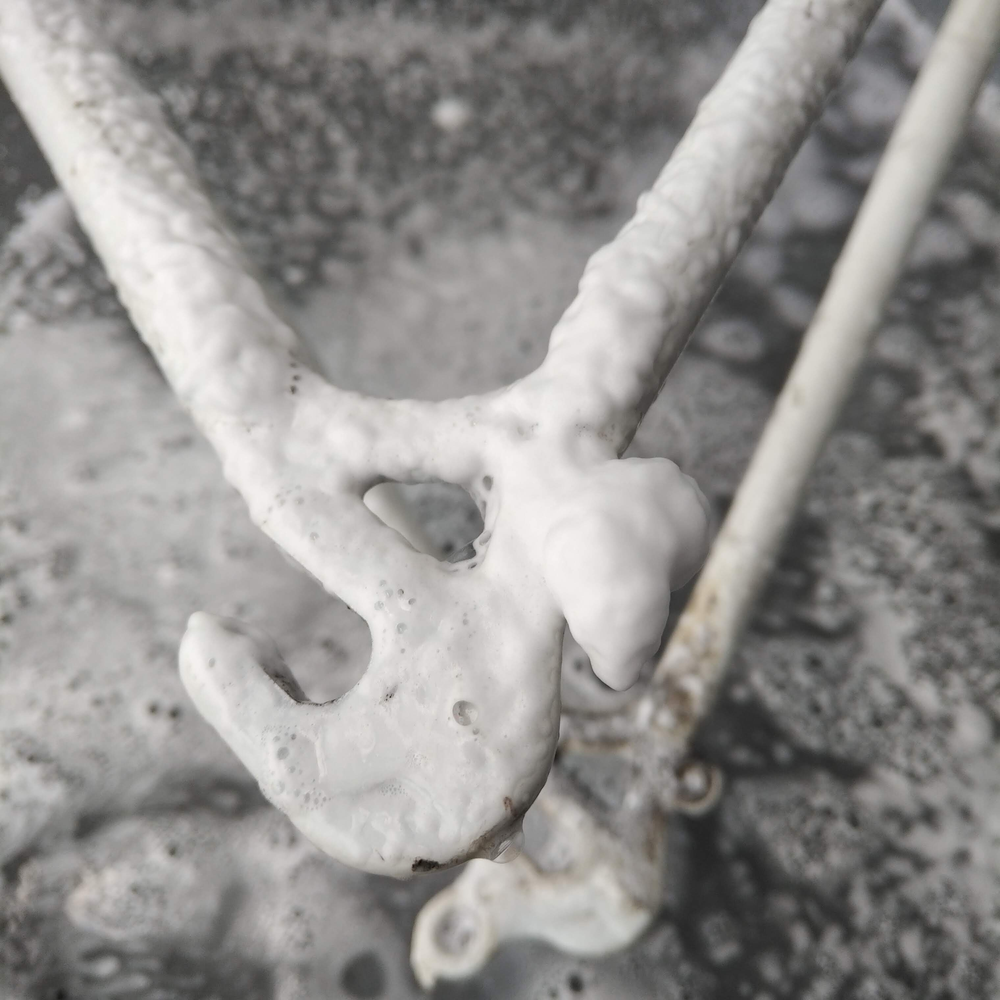
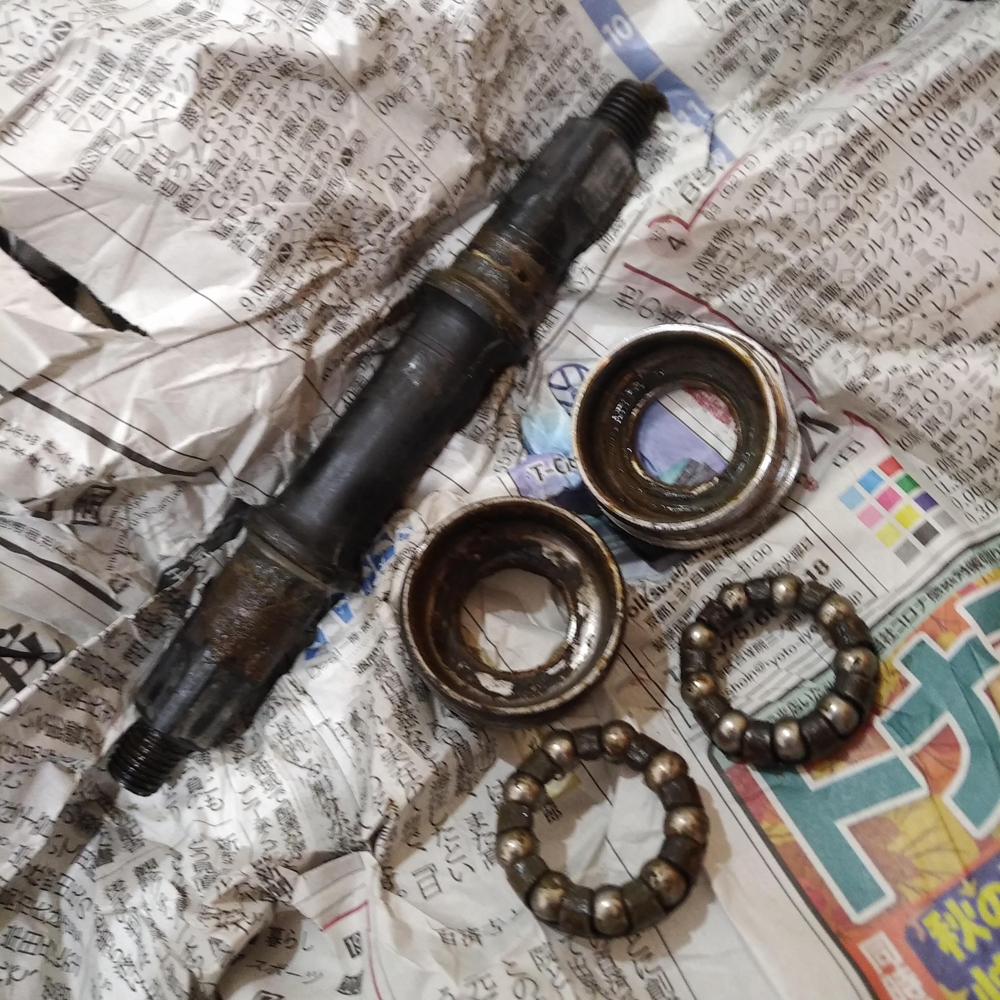
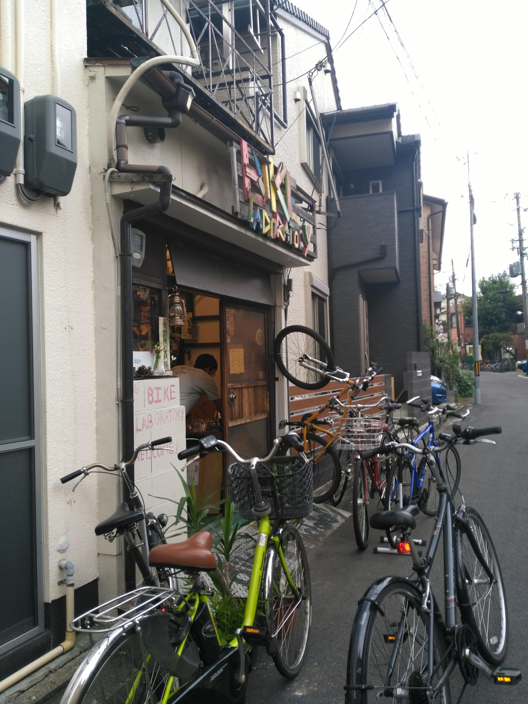
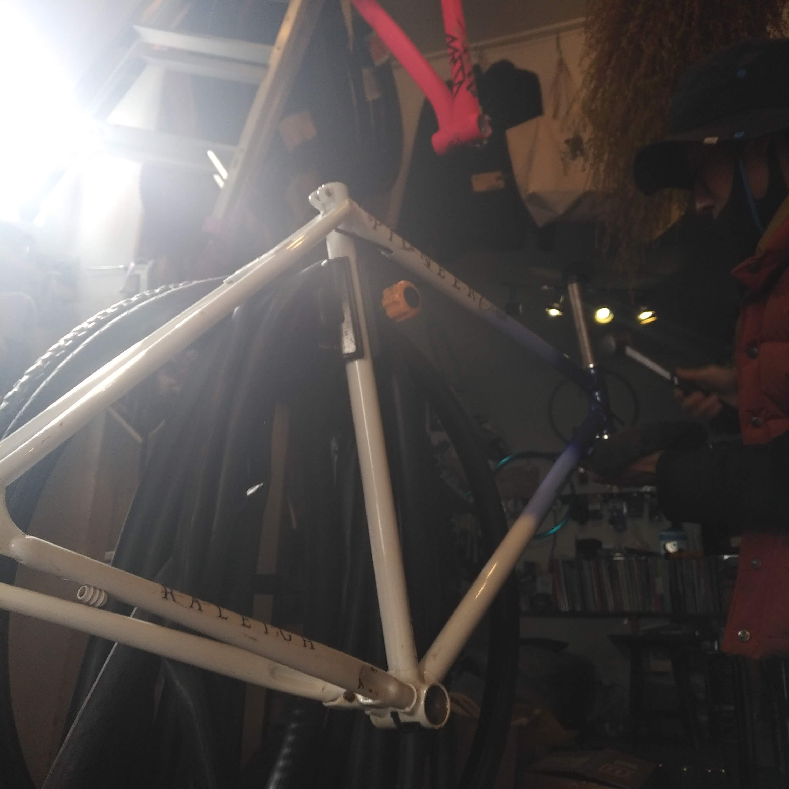
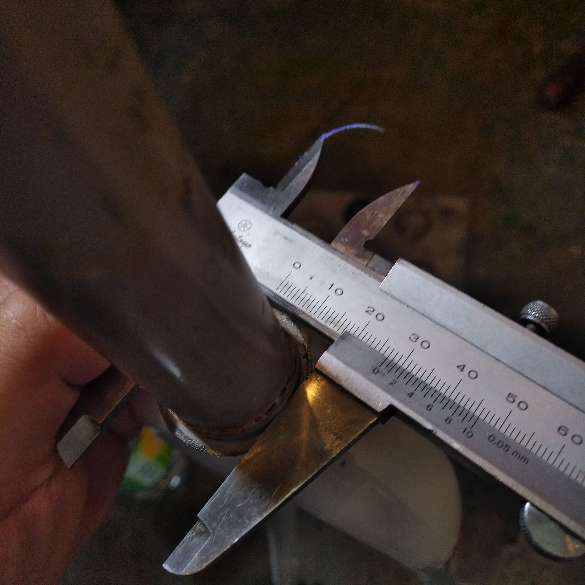
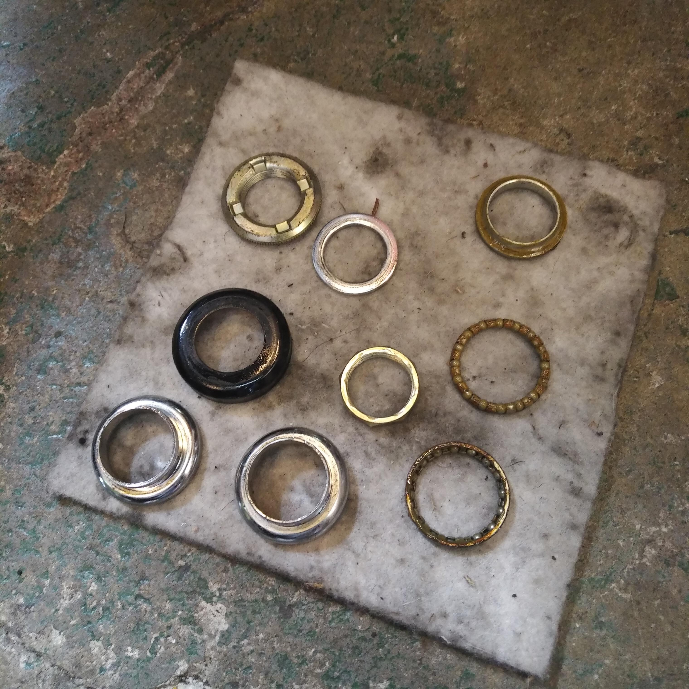

# ダイソーの噴霧器でらくらくフレーム洗浄

やや陶酔ぎみの[前回の記事](../raleigh-pioneer-classic-1)ではキレイに撮れた写真しか上げなかったが実は汚れがかなりひどかった。
ところどころに泥が付いていたり、ヘッドチューブのなかには蜘蛛の巣が張っていた。
余談であるが、かつて長い間野外に放置された軽快車をバラしたことがある。
固着したハンドルをなんとか外しヘッドチューブを覗いてみると茶色い塊がある。
グリスの塊かと思いほじくり出してみると蜂の巣だった。
ヘッドチューブはどうやら生き物たちにとって居心地のよい場所であるようだ。  
今日はフレームを洗浄して、BB やヘッドパーツの状態を確認するところまでやってしまいたい。

自動車 DIY 系の YouTuber をたまに観るのだが、洗車のハウツーを教える動画でダイソーのポンプ式噴霧器に洗剤を入れて使うと便利だと教えていてなるほど！と思った。
ダイソーの園芸コーナーに置いてある。そこそこの人気商品らしく少し大きめの店に行かないと置いてないかもしれない。300 円であった。

泥や油汚れを取るのであれば台所用の食器用洗剤で十分である。
水と洗剤の割合は忘れてしまったが、初め洗剤を入れすぎて失敗したことは覚えている。
ポンプで圧力がかかってかなり細かい泡になって出るので洗剤は少なめでもかなりキレイになる。1 時間もやっていると手が荒れてくるのでゴム手袋をすることをおすすめする。

# 洗いたてのフレームは雨上がりの虹のように

洗い終わったら水気をしっかり切って、表面をきれいなクロスで拭いておく。
季節は秋である。ほの暖かい陽気と時折吹くうす冷たい空気がなんともいえず気持ちいい。
冬に向かって短くなっていく昼間を噛み締めて過ごすようである。

などと言っているうちにあっけなく BB が外れてしまった。
呉やラスペネなんかを用意して構えていたのに拍子抜けである。
BB シェルの下側になにやら齧ったような跡があるから、前のオーナーが無理やり外してくれたのかもしれない。
嬉しいといえば嬉しいのであるが、あまりにあっけないのは寂しくもある。

BB の詳細情報  
| シェル幅 | 総軸長 | 左軸長 | 右軸長 |
| -------- | ------- | ------ | ------ |
| 68mm | 124.5mm | 35mm | 37.5mm |

# ヘッドパーツを外してもらいに自転車屋へ

お次はヘッドパーツである。しかし、外せたところで圧入は自分ではできない。
折角なのでいろいろ教えてもらいに近所のプロショップへ。

京都市北区小山下内河原町にある Bike laboratory は木造 2 階建ての 1 階を店舗にした個人経営の小さな自転車屋さんである。北大路通沿いの量販店のような品揃えはないのだが、店主の楠本さんの自転車についての知識・技術、そしてなにより明るい人柄が自転車乗りを惹きつけている。修理や改造に困ったらここに行けばなんとかなる。
このブログでもなんども世話になることだろう。

教えてもらって初めて知ったのだが、1 インチヘッドパーツには JIS 規格とイタリアン規格という 2 種類が存在するらしい。
ほんの零点何ミリの違いであるが二者の間には互換性はないそうだ。

結論としてこの自転車のフロントフォークは JIS 規格のものだった。
フロントフォークの下玉押しが当たる部分の外径をノギスで計り、27.0mm であれば JIS 規格、26.4mm であればイタリアンなのだそう。素人目には 0.6mm の差は誤差の範疇としてしまいたくなるところだが、そういうわけにはいかないようだ。

無事ヘッドパーツがはずれた。ゴムのパーツに「TANGE JAPAN」とあった。ただ、型番まではわからなかった。

# この自転車はどこから来たのか

ところでこの自転車はいつ作られたものなのだろうか。
この問いはずっと棚上げされたままである。
ヘッドパーツと新しい BB を注文したが到着までにはもう少し掛かりそうだ。
次はフレームのタッチアップでもしながらこの自転車の来歴についてもう少し迫ってみたい。
